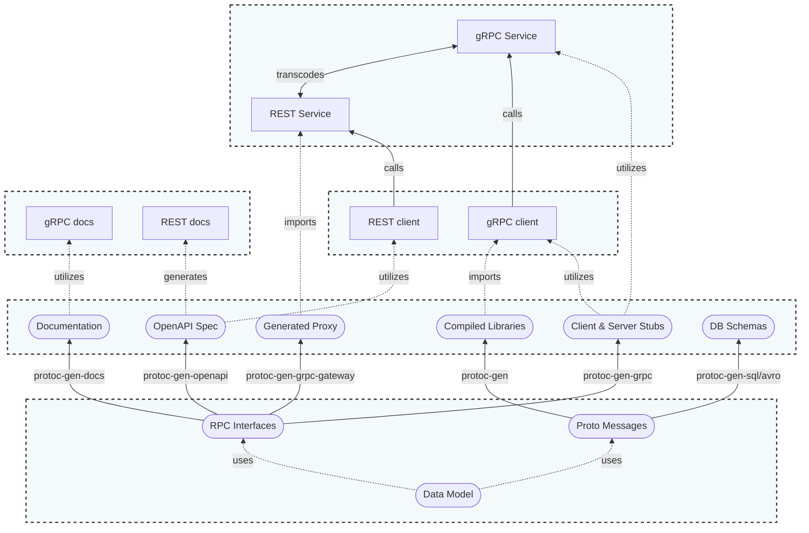

# Proto Sample

* [Overview](#overview)
* [Architecture](#architecture)
* [Quick Start](#quick-start)
* [Development](#development)
* [Data Model](#data-model)

# Overview

This Proto Sample repository provides a psuedo type-driven, data-model-first example for application design that showcases standardization and automatic generation of dependent data and application components. By starting with a well-defined, core data model using protobuf, application owners are able to create compiled libraries, sample servers or clients, and documentation using specific plugins and extensions based on the core model. This initial, non-exhaustive list includes the primary features:

* Protobuf data model
* gRPC service interface
* language specific libraries
* simple gRPC server
* CLI client examples

These additional features in the Proto Sample are utilized for simplcity:

* relational database storage
* object relational mapping

The [Data Model Dependency Graph](#data-model-dependency-graph) highlights data model dependencies with the foundational layer at the bottom which is utilized to automate the build-out of the upstream components.

## Data Model Dependency Graph

The gRPC service's interface, method, and REST transcoded resources follow the Google Cloud API and API Improvement Proposals naming standards ([here](https://cloud.google.com/apis/design/naming_convention) and [here](https://google.aip.dev/))

# Architecture

# Quick Start

## Deployment

Build & deploy the components in a kubneretes environemnt (TBD) or separately on your local machine

### Kubernetes

TBD - placeholder for kubernetes-manifests and helm/deployment

### Separately

Follow instructions in the [Development](#development) section below.

## Validation

After you have an instance of the gRPC server running, you can use either the [grpcurl](#grpcurl-client) or the [samplectl](#samplectl-client) executable CLI client to validate and communicate with the gRPC server interface methods. Both clients leverage the same gRPC server interfeace API methods defined in the [sample_service.proto](./proto/sample/v1alpha/sample_service.proto)

### grpcurl client

**tl;dr** From [grpcurl](https://github.com/fullstorydev/grpcurl):
> grpcurl is a command-line tool that lets you interact with gRPC servers. It's basically curl for gRPC servers.

Install the `grpcurl` CLI to your local machine to communicate with the gRPC server. eg. OSX

    $ brew install grpcurl

List available gRPC server services (via reflection)

    $ grpcurl -plaintext localhost:10000 list

List all methods of an available service(s) (via reflection)

_*Note*_ You will need the service proto files (and import the directories of the proto dependencies) for the gRPC server service reflection to work

    $ grpcurl -plaintext -import-path third_party/googleapis -import-path third_party/protoc-gen-gorm -import-path proto -proto sample/v1alpha/sample_service.proto localhost:10000 list sample.v1alpha.SampleService

#### Sample interface methods

Try out some of the gRPC interface methods with `grpcurl`:

GetBook:

    $ grpcurl -plaintext -d '{"name": "123"}' -import-path third_party/googleapis -import-path third_party/protoc-gen-gorm -import-path proto -proto sample/v1alpha/sample_service.proto localhost:10000 sample.v1alpha.SampleService/GetBook

CreateBook:

    $ grpcurl -plaintext -d '{"book": {"name": "123"} }' -import-path third_party/googleapis -import-path third_party/protoc-gen-gorm -import-path proto -proto sample/v1alpha/sample_service.proto localhost:10000 sample.v1alpha.SampleService/CreateBook

ListBooks:

    $ grpcurl -plaintext -d '{"name_prefix": "1234"}' -import-path third_party/googleapis -import-path third_party/protoc-gen-gorm -import-path proto -proto sample/v1alpha/sample_service.proto localhost:10000 sample.v1alpha.SampleService/ListBooks

### samplectl client

Install the `samplectl` exutable CLI client on your local machine to communicate with the gRPC server. Follow the directions for [CLI client](#cli-client) below to build & install locally. You ma

List the help for the client

    $ sampletlctl -h

# Development

Setup a local development environemnt to build the Proto Sample executables to test the functionality and generate the appropriate libraries. You will need to following prerequisites:

* Golang
* proto files
* database
* server & client executables

## Golang

First, verify you have golang >= 1.20.x installed, or download from [Go.dev](https://go.dev/dl/)

    $ go version
    go version go1.20 linux/amd64

Set the GO_PATH environment variables in you shell profile config after install:

    echo "export GO_PATH=~/go" >> ~/.bash_profile
    echo "export PATH=$PATH:/$GO_PATH/bin" >> ~/.bash_profile
    source ~/.bash_profile

Next, clone or download this project and download the package dependencies

    go mod download

If initial version, instatiate `go mod` and `go mod tidy`

    go mod init github.com/phriscage/proto_sample
    go mod tidy

## Protobuf

Generate the protobuf files for the following languages: *Golang*

Install Protobuf tools and libraries:
*OSX*

    brew install protobuf

*Linux*

    sudo apt-get install -y protobuf-compiler
    #sudo apt-get install -y golang-goprotobuf-dev

Install Go plugins:

    go install google.golang.org/protobuf/cmd/protoc-gen-go@v1.28
    go install google.golang.org/grpc/cmd/protoc-gen-go-grpc@v1.2
    go install github.com/infobloxopen/protoc-gen-gorm@latest

Download protobuf 3P build dependencies:
_TODO_ Add [Buf](https://buf.build/) to streamline proto build process
*Make directories*

    mkdir -p third_party

*Service*

    git clone https://github.com/googleapis/googleapis third_party/googleapis

*GORM*

    git clone https://github.com/infobloxopen/protoc-gen-gorm third_party/protoc-gen-gorm

*BQ Schemas*

    git clone https://github.com/GoogleCloudPlatform/protoc-gen-bq-schema third_party/protoc-gen-bq-schmea

Generate libraries:
*Make directories*

    mkdir -p gen/go

*Service*

    protoc -I proto -I third_party/googleapis -I third_party/protoc-gen-gorm --go_out ./gen/go/ --go_opt paths=source_relative --go-grpc_out ./gen/go/ --go-grpc_opt paths=source_relative proto/sample/v1alpha/*.proto

*GROM*

    protoc -I proto -I third_party/googleapis -I third_party/protoc-gen-gorm --gorm_out ./gen/go/ --gorm_opt paths=source_relative proto/sample/v1alpha/*.proto

*BQ Schemas*

    protoc -I temp -I third_party/protoc-gen-bq-schema --bq-schema_out=temp/bq_schema temp/bq_schema/foo.proto

## Database

Follow instructions in the [db/README](db/README.md)

## Executables

Generate the gRPC server and executable CLI client.

Create the [/bin](./bin) directory and export in the PATH environment variable:

    mkdir -p bin && export PATH=$PATH:${PWD}/bin

### gRPC server

Build the server

    GO111MODULE=on go build -o bin/samplesrv ./server/.

Test

    samplesrv -h

### CLI client

Build the client

    GO111MODULE=on go build -o bin/samplectl ./cmd/sample

Test

    samplectl -h

# Wishlist

These are some additional feature components I would like to include/showcase in this example

* automated build tool
* deployment configurations
* gRPC to REST transcoding
* custom data model field extensions
* schema and DDL converters
* tests, tests, tests!
